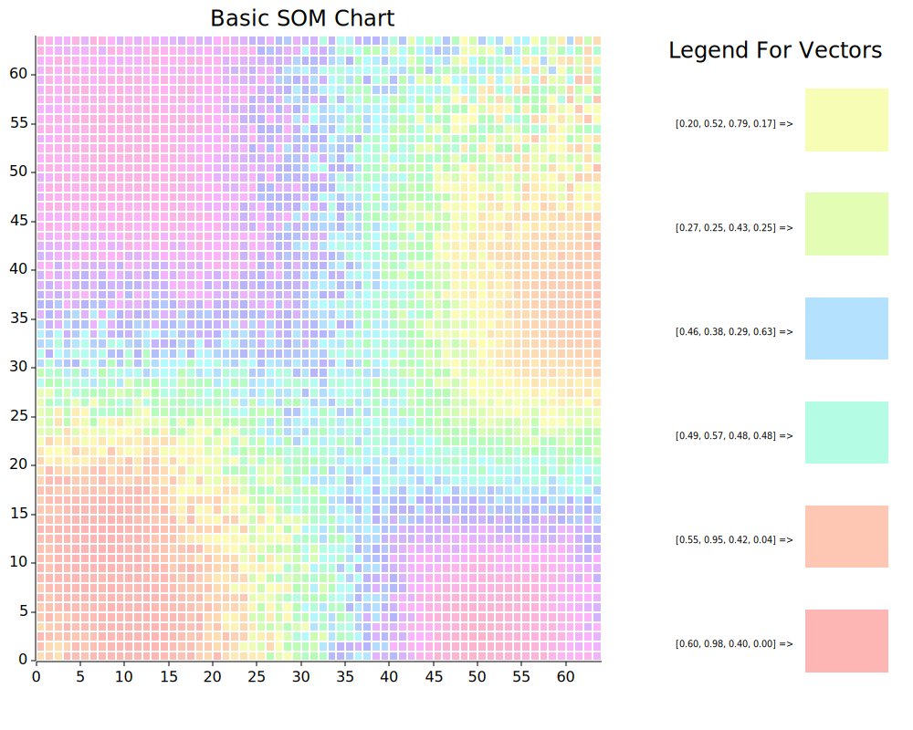

## Project Roadmap:

##### Foundational Stage:
1. simple SOM method (status: real field needs some tweaks though almost done; other algebras need operations added to it before implementing SOMs)
2. SOM visualization method(s) (status: bulk of the real field on is done, much work need to be done on it through)
    1. add a 3d version as well to better display the vectors
    2. add discrete contour map?
3. Real Field SOM trees (nested/hierarchical SOMs), plus ensuring any algebra implementation can be used for vector elements (status: not started)

##### Lab Stage:
5. Illogical SOMs (status: not started)

#### Additional Notes

current state of algebras:
* polymorphism moved up the chain so that each algebra has it's own SOM function, this allows code to be more readable and have less edge cases

current state of visuals:
* need to implmement more control + reactive visuals
* current state of the basic visual:
